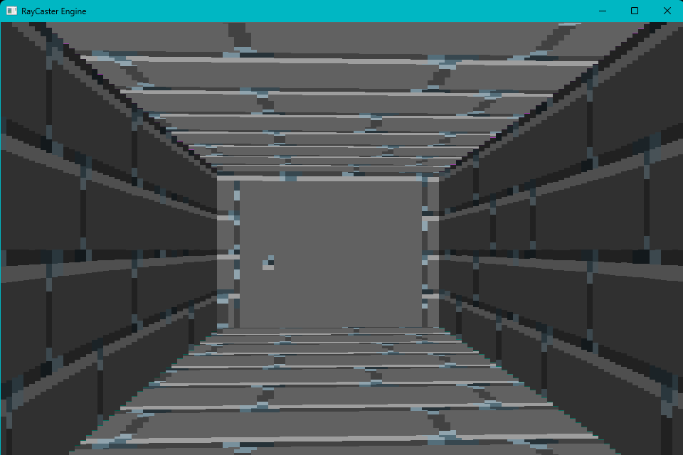
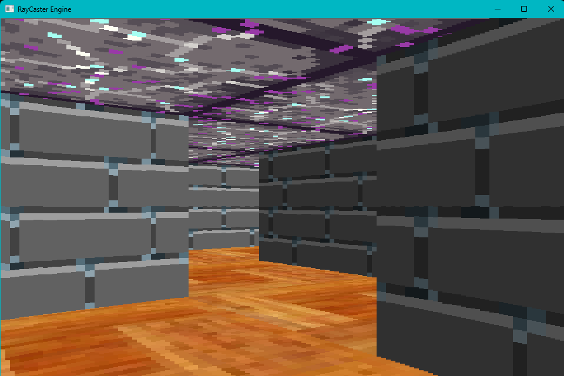

# Raycaster Engine

  

A full-featured 2.5D rendering engine built with C++ and the SFML library. This project simulates a 3D environment by projecting rays through a 2D grid, inspired by the rendering techniques of classic games like *Wolfenstein 3D*.

---

## Features

* **2.5D Rendering:** Real-time rendering of textured walls, floors, and ceilings.
* **Level Logic:** Includes 3 demo levels featuring:
    * **Kill Blocks:** Tiles that reset the player upon contact.
    * **Win Blocks:** Tiles that trigger a level completion.
* **Interactive Doors:** Functioning door mechanics via player interaction.
* **Texture Converter:** A built-in `BMP-to-Array` tool to prepare image data for the engine's pixel-by-pixel rendering pipeline.

---

## Technical Overview

### How it Works
The engine treats the game world as a 2D grid. To create the illusion of 3D, it casts rays from the player's position across their Field of View (FOV). 

1. **Distance Calculation:** The engine calculates the distance between the player and the first wall hit by a ray.
2. **Projection:** Using the distance, the engine determines the height of a vertical slice to draw on the screen.
3. **Texture Mapping:** The engine maps vertical strips of a texture array onto these slices.

### Texture Modification
To change the textures in the game, follow these steps:
1.  Open `Image.bmp` and modify the graphics. Save it specifically as a **BMP** file.
2.  Run `V-1\Converter\BMP_to_Array.exe`.
3.  The converter will translate the image into an array format required for the pixel-by-pixel renderer.
   
*Note: Do not change the dimensions of individual texture blocks, as this will cause rendering misalignments.*

---

## Controls

| Action | Key Binding |
| :--- | :--- |
| **Move Forward** | `W` or `Up Arrow` |
| **Move Backward** | `S` or `Down Arrow` |
| **Turn/Move Left** | `A` or `Left Arrow` |
| **Turn/Move Right** | `D` or `Right Arrow` |
| **Open Doors** | `E` |

---

## Credits & References

* **Library:** [SFML](https://www.sfml-dev.org/)
* **Inspiration:** [3D Sage (YouTube)](https://www.youtube.com/@3DSage)
* **Technical Logic:** [Lode's Raycasting Tutorial](https://lodev.org/cgtutor/raycasting.html)
* **Texture Tool Foundation** [7IRE's ASCII ART](https://github.com/7IRE/ASCII-ART)